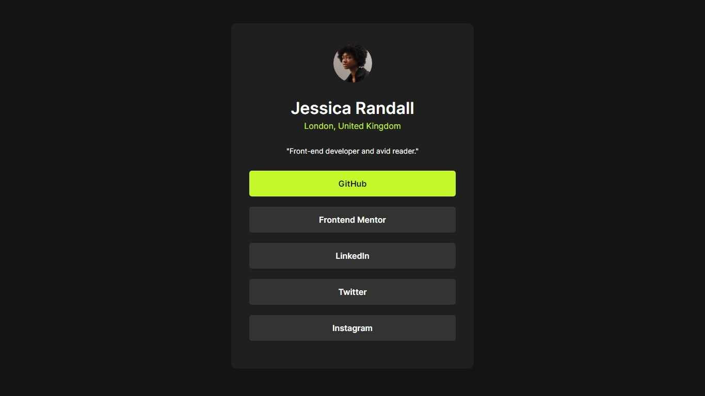

# Frontend Mentor - Social links profile solution

This is my solution to the [Social links profile challenge on Frontend Mentor](https://www.frontendmentor.io/challenges/social-links-profile-UG32l9m6dQ). Frontend Mentor challenges help you improve your coding skills by building realistic projects. 

## Table of contents

- [Overview](#overview)
  - [The challenge](#the-challenge)
  - [Screenshot](#screenshot)
- [My process](#my-process)
  - [Built with](#built-with)
  - [What I learned](#what-i-learned)
  - [Useful resources](#useful-resources)
- [Author](#author)

## Overview

### The challenge

Users should be able to:

- See hover and focus states for all interactive elements on the page

### Screenshot

## My process

### Built with

- HTML5
- CSS 
- Flexbox

### What I learned

while doing the challenge, I was able to consolidate the concepts of flexbox and media queries to make it more responsive

### Useful resources

- [W3schools](https://www.w3schools.com/css/css_rwd_mediaqueries.asp) - This helped me apply media queries.

## Author

- Frontend Mentor - [@mairapaulac](https://www.frontendmentor.io/profile/mairapaulac)
- LinkedIn - [Maíra Paula](https://www.linkedin.com/in/maíra-paula-de-oliveira-cruz-64982120b/)

